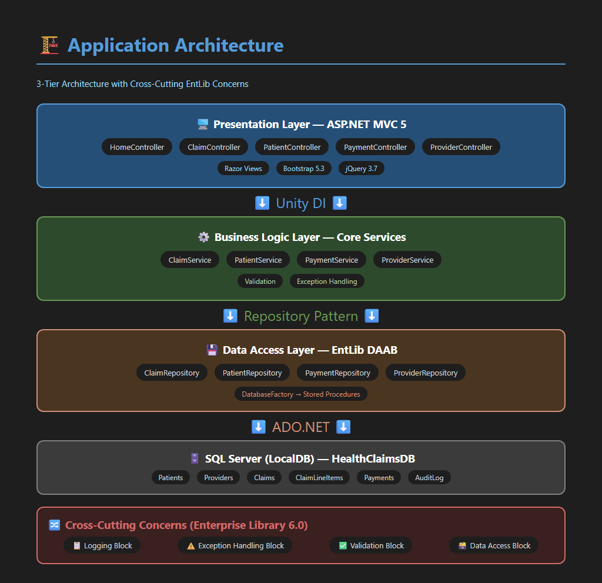
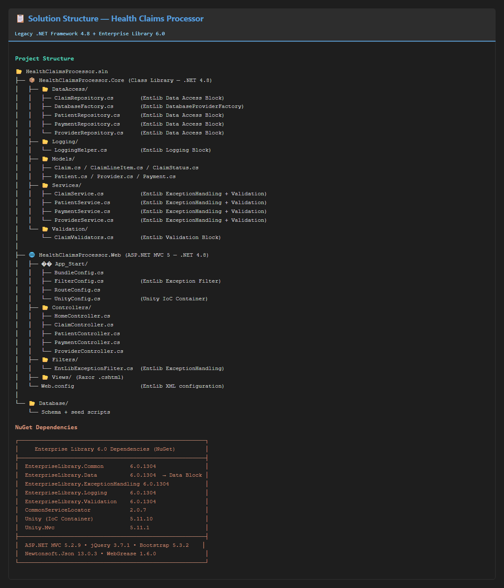
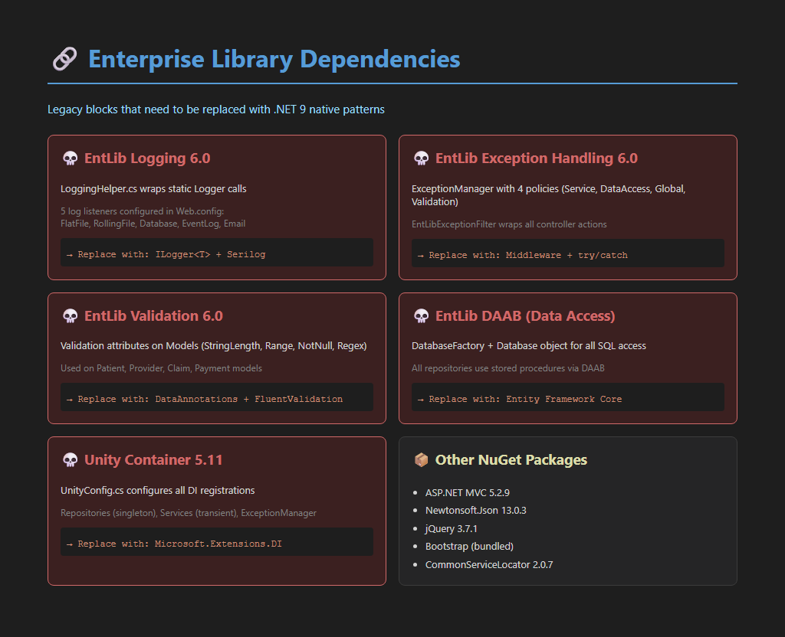
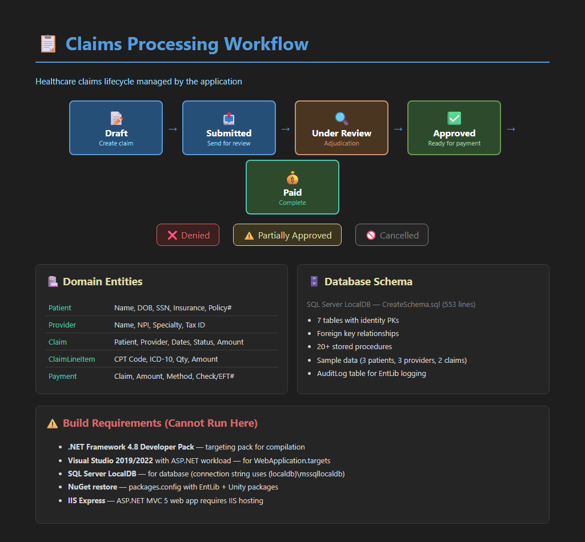
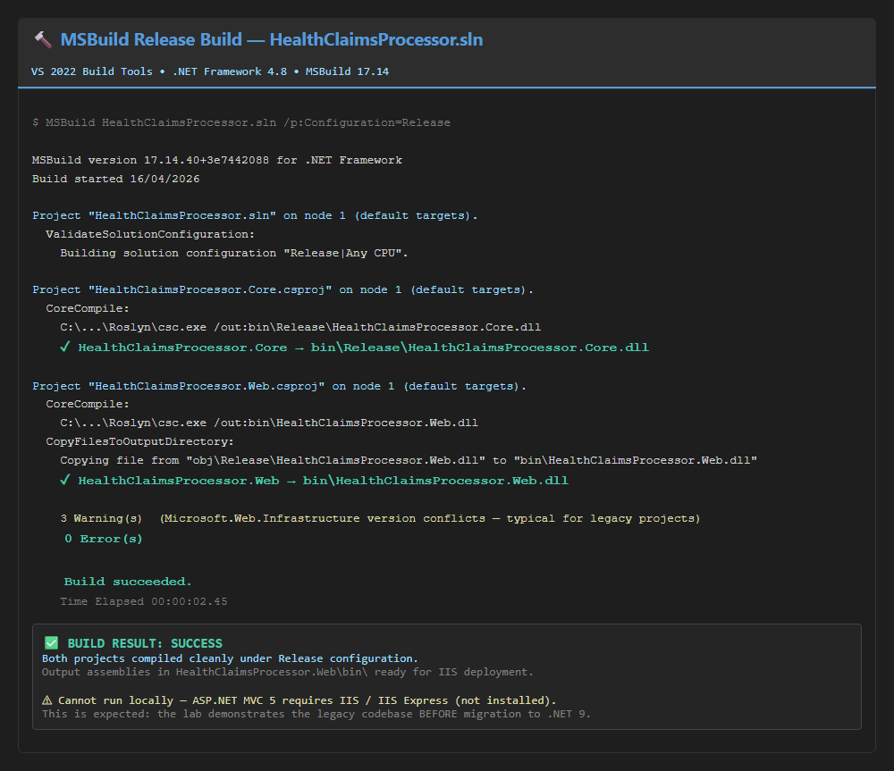
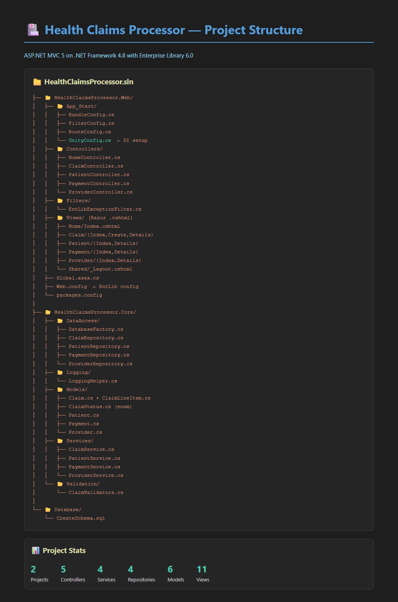

## Overview

This lab walks you through replacing Microsoft Enterprise Library patterns in a .NET Framework 4.8 healthcare claims processing application with native .NET 9 Core dependency injection, logging, exception handling, and data access patterns. You will modernize each layer of the application—swapping EntLib logging for Serilog, EntLib Data Access for Entity Framework Core, and XML-based configuration for the built-in .NET Core configuration and DI system.

*High-level architecture of the claims processing application showing the key components targeted for modernization.*

## The Legacy Application

The existing application is a multi-project .NET Framework 4.8 solution that processes healthcare insurance claims. It relies heavily on Microsoft Enterprise Library for cross-cutting concerns including logging, exception handling, data access, and caching.

*The solution is organized into multiple projects separating web, business logic, data access, and shared infrastructure layers.*

Enterprise Library is deeply embedded across the codebase, with dependencies on `Microsoft.Practices.EnterpriseLibrary.Logging`, `ExceptionHandling`, and `Data` packages wired through XML configuration files.

*NuGet package references showing the Enterprise Library dependencies that will be replaced with native .NET Core equivalents.*

The claims workflow spans multiple layers—from the ASP.NET web front-end through business rules validation and into SQL Server persistence—all coordinated through EntLib's block-based patterns.

*End-to-end claims processing workflow illustrating how data flows through the application layers.*

## Getting Started

Before beginning the migration, verify that the legacy application compiles successfully. The solution builds with VS 2022 Build Tools (MSBuild 17.14) targeting .NET Framework 4.8.

*A successful release build confirms the starting point is stable and ready for migration.*

## Initial Application Screenshots

> **Note:** This is a .NET Framework 4.8 application that requires IIS/IIS Express to run. It was successfully built using VS 2022 Build Tools (MSBuild 17.14) with the .NET Framework 4.8 targeting pack. The app cannot run standalone — it requires IIS hosting, which is not available in this environment.

### MSBuild Release Build (VS 2022 Build Tools)

### Solution Structure

### Project Structure

### Enterprise Library Dependencies

### Application Architecture

### Claims Processing Workflow & Build Requirements

## Solution

The completed migration is available on the [`solution-final`](../../tree/solution-final) branch with step-by-step tagged commits:

| Tag | Description |
|-----|-------------|
| `step-01-explore-legacy` | Analyze legacy EntLib usage across the codebase |
| `step-02-map-entlib` | Map EntLib patterns to .NET 9 equivalents |
| `step-03-migration-plan` | Create phased migration plan |
| `step-04-migrate-logging` | Replace EntLib Logging with Serilog + ILogger<T> |
| `step-05-migrate-data` | Replace EntLib DAAB with Entity Framework Core 9 |
| `step-06-migrate-exceptions` | Replace EntLib Exception Handling with try/catch + ILogger |
| `step-07-setup-di` | Replace Unity with ASP.NET Core native DI |
| `step-08-build-validate` | Build succeeds with zero errors, all EntLib removed |

Each step output is documented in `assets/outputs/step-NN.txt` on the solution branch.
